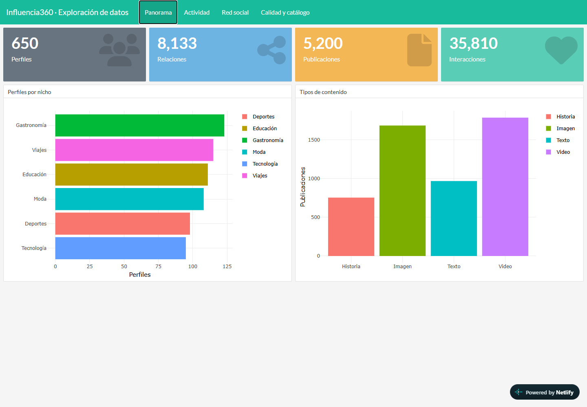
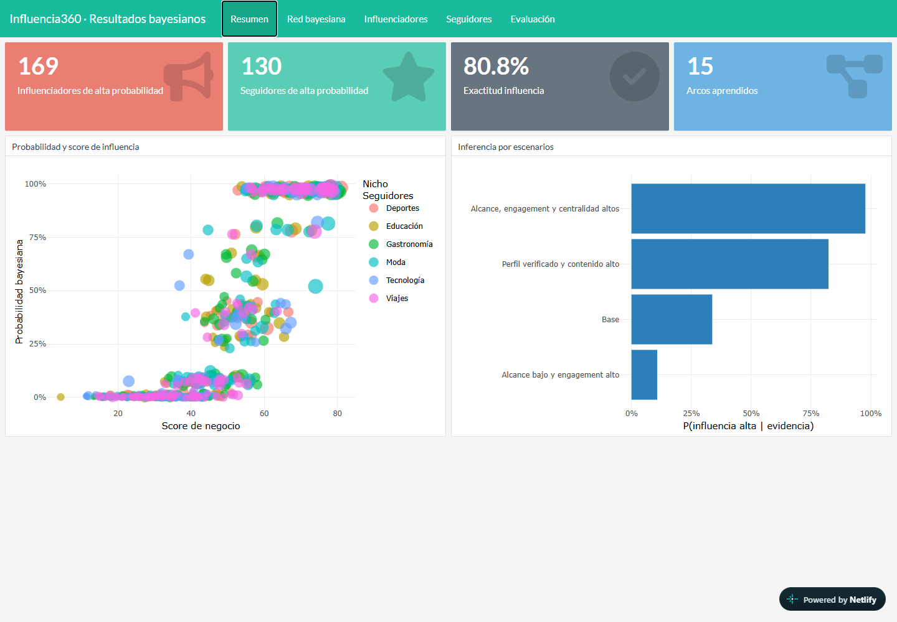

# 1. Objetivo y proyecto utilizado

Recrear localmente Influencia360, conservar una copia en GitHub y publicar al menos dos reportes en internet. Se eligió Netlify para alojar los HTML generados con R Markdown.

El repositorio original es [rubendcl/Influencers](https://github.com/rubendcl/Influencers). El enlace duplicado de la consigna corresponde a esa única dirección. El proyecto simula una red social y aplica redes bayesianas para analizar influenciadores y seguidores. Los datos son completamente ficticios.

**Carpeta local:** `C:\Users\isabe\Influencers`.

**Repositorio propio:** [monicaisabelbr/Influencers](https://github.com/monicaisabelbr/Influencers), copia (fork) del original.

**Sitio público:** [influencersbi2.netlify.app](https://influencersbi2.netlify.app/), publicado con Netlify Drop y comprobado sin sesión de Netlify.

# 2. Recreación local, paso a paso

1. Se comprobó que la carpeta era una copia Git del repositorio original y que inicialmente no tenía cambios pendientes.
2. Se utilizó R 4.5.3 y Pandoc. Se instalaron las dependencias faltantes en `.Rlib`, dentro del proyecto, mediante `Rscript scripts/preparar.R`.
3. Se añadió `DiagrammeR` a las dependencias declaradas porque el informe general lo utiliza. También se corrigió el tratamiento de UTF-8 en Windows para leer las tildes de los archivos R.
4. Se ejecutó `Rscript run_all.R`. La secuencia generó datos, validó su calidad, entrenó el modelo y renderizó los tres reportes en `docs`.
5. Se conservaron los HTML generados para publicarlos como archivos estáticos. La instalación de R y el entrenamiento ocurren localmente; esta configuración de Netlify únicamente distribuye el resultado.

Para repetir la ejecución desde PowerShell:

```powershell
Set-Location C:\Users\isabe\Influencers
$env:LC_ALL = 'English_United States.utf8'
Rscript scripts/preparar.R
Rscript run_all.R
```

La ejecución realizada generó 650 perfiles, 8.133 relaciones, 5.200 publicaciones y 35.810 interacciones. Se aprobaron los 12 controles de calidad. El modelo aprendió 15 arcos y alcanzó 80,8 % de exactitud para cada objetivo, con 520 registros de entrenamiento y 130 de prueba. Estos resultados describen la simulación; no demuestran causalidad ni rendimiento sobre personas reales.

# 3. Reportes y procedimiento de publicación

| Archivo | Contenido | Ruta en el sitio |
|---|---|---|
| `dashboard_datos.html` | Exploración de perfiles, relaciones, publicaciones e interacciones; gráficos y tablas interactivas. | [Abrir reporte de datos](https://influencersbi2.netlify.app/dashboard_datos.html) |
| `dashboard_resultados.html` | Rankings, estructura de la red bayesiana, probabilidades y escenarios. | [Abrir reporte de resultados](https://influencersbi2.netlify.app/dashboard_resultados.html) |
| `index.html` | Informe metodológico y ejecutivo, con enlaces a los dashboards. | [Abrir informe general](https://influencersbi2.netlify.app/) |

Los dos dashboards satisfacen el requisito de dos reportes. El informe general es un tercer documento complementario.

## Publicación realizada con Netlify Drop

1. Crear una cuenta en [Netlify](https://app.netlify.com/signup), ingresar con GitHub y utilizar el plan gratuito.
2. Abrir [Netlify Drop](https://app.netlify.com/drop) con la sesión iniciada.
3. Arrastrar únicamente la carpeta `docs`, que contiene `index.html` y los dos dashboards.
4. Esperar a que termine la carga. Si el proyecto aparece privado, seleccionar **Make public** o cambiar **Project visibility** a **Public**.
5. Copiar la URL asignada y abrir cada ruta de la tabla en una ventana sin sesión para verificar el acceso del docente.
6. Guardar las URLs y capturas como evidencias. Para futuras actualizaciones, regenerar los HTML y cargar `docs` en la sección **Deploys del mismo proyecto**.

Se siguió este procedimiento y se creó el proyecto público **influencersbi2**. La carga manual permite publicar archivos ya construidos. No sincroniza automáticamente las modificaciones de GitHub. Fuente: [formas de desplegar en Netlify](https://docs.netlify.com/deploy/create-deploys/).

## Alternativa con despliegue automático desde GitHub

El archivo `netlify.toml` deja preparado `publish = "docs"` y el comando de construcción vacío. Al conectar el repositorio propio en **Add new project > Import an existing project > GitHub**, se debe elegir `main`, la raíz del repositorio como base, ningún comando de construcción y `docs` como directorio de publicación. Se regeneran los HTML localmente y se suben a GitHub antes de cada actualización. La integración publica los archivos guardados en `docs`; no ejecuta R.

# 4. Características básicas de la solución

La publicación realizada es un sitio estático: el navegador recibe HTML y JavaScript y ejecuta las interacciones de Plotly, DataTables y visNetwork. No necesita instalar R. Los filtros y gráficos funcionan con los datos incluidos en cada HTML; no reentrenan el modelo ni consultan una base de datos en tiempo real.

Netlify aporta distribución mediante CDN y HTTPS. El plan gratuito resulta apropiado para una entrega académica de tráfico limitado, sujeto a sus cuotas. No se necesita comprar un dominio para compartir los reportes. Fuente: [características de los planes](https://www.netlify.com/pricing/).

# 5. Dirección de internet cualquiera

**Sí: Netlify asigna por defecto un subdominio** con la forma `https://nombre-del-proyecto.netlify.app`. Se puede cambiar el nombre si está disponible. Esto evita comprar un dominio. Cada reporte se comparte añadiendo su ruta, por ejemplo `/dashboard_datos.html`. Ese ejemplo describe el formato; las direcciones reales se registran en las evidencias de la entrega. Fuente: [dominios predeterminados](https://docs.netlify.com/manage/domains/domains-fundamentals/understand-domains/).

Tener URL y permitir acceso público son configuraciones distintas. En las cuentas nuevas con planes por créditos, los proyectos pueden comenzar privados; para distribuir esta tarea se debe comprobar que la visibilidad sea pública. Fuente: [visibilidad de proyectos](https://docs.netlify.com/manage/security/secure-access-to-sites/project-visibility/).

# 6. Dirección específica o de la empresa

Se puede usar un dominio propio, por ejemplo `reportes.empresa.com`, como ejemplo hipotético. La empresa debe poseer el dominio o registrar uno disponible. En Netlify se agrega desde **Domain management > Add a domain**. Después se configuran los registros DNS en Netlify DNS o en el proveedor externo. Fuente: [asignar un dominio](https://docs.netlify.com/manage/domains/manage-domains/assign-a-domain-to-your-site-app/).

Para un subdominio suele utilizarse un CNAME hacia `nombre-del-proyecto.netlify.app`, siguiendo las instrucciones específicas del panel. Netlify permite HTTPS con certificados administrados. Asociar un dominio al alojamiento y pagar su registro/renovación son asuntos distintos; el dominio puede generar un costo aunque el alojamiento sea gratuito. Fuente: [configuración de dominios y DNS](https://docs.netlify.com/manage/domains/get-started-with-domains/).

# 7. Mucho volumen de información

**Sí involucra al servicio**, por el ancho de banda, las solicitudes y las cuotas del plan; también involucra al diseño del reporte. Servir una página desde una CDN no evita que el navegador tenga que descargar y procesar sus datos.

En este proyecto, el reporte de datos pesa 10,08 MB, el de resultados 10,10 MB y el informe general 8,62 MB (MB decimales, medidos localmente). Los HTML autocontenidos incorporan bibliotecas y datos. Como estimación, un reporte de 10 MB abierto completamente 1.000 veces transferiría unos 10 GB antes de considerar compresión, caché y otros recursos. Esta estimación no es una medición de facturación.

Para crecer, propondría compartir bibliotecas entre páginas, mostrar datos agregados y cargar detalles bajo demanda. Una tabla paginada solo en el navegador todavía descarga todos los registros incluidos en el HTML. Para millones de registros convendría consultar una base de datos mediante una API con paginación en el servidor, en lugar de incrustarlos en cada reporte.

Netlify ofrece Database para datos estructurados y Blobs para archivos u objetos. También podría integrarse una base de datos o almacenamiento externo, según el volumen y las consultas. Esta sería una ampliación de la arquitectura; la entrega actual no utiliza esos servicios. Fuente: [almacenamiento y bases de datos](https://docs.netlify.com/build/data-and-storage/overview/).

El plan Free vigente tiene un límite mensual de 300 créditos. El consumo se reparte entre despliegues, tráfico y otros recursos; alcanzar el límite puede pausar los sitios. Para más demanda se revisaría el uso real y la conveniencia de un plan de pago. Fuente: [precios y límites](https://www.netlify.com/pricing/).

# 8. Usuarios específicos o con credenciales

**Sí: se puede resolver dentro de Netlify o integrando autenticación externa.**

- **Acceso interno:** la visibilidad privada exige inicio de sesión en Netlify. Free y Personal restringen el proyecto privado al propietario; Pro permite incorporar miembros del equipo. Esto sirve para un equipo de analistas. Fuente: [visibilidad de proyectos](https://docs.netlify.com/manage/security/secure-access-to-sites/project-visibility/).
- **Contraseña compartida:** la protección de sitio con contraseña está disponible en Pro. Permite entregar un mismo acceso a un grupo, pero no identifica individualmente a cada visitante. Fuente: [protección por contraseña](https://docs.netlify.com/manage/security/secure-access-to-sites/password-protection/).
- **Clientes con permisos distintos:** se puede integrar un proveedor de identidad externo y validar sesiones o JWT antes de entregar páginas o datos. Netlify documenta reglas de acceso por roles con JWT; la disponibilidad depende del plan y de la configuración. Se podría permitir a un cliente ver únicamente su campaña. Fuente: [control por roles con JWT](https://docs.netlify.com/manage/security/secure-access-to-sites/role-based-access-control/).

En una futura versión privada, la autorización debe proteger los HTML y las fuentes de datos, incluidas sus rutas directas. Ocultar un enlace o agregar una pantalla de inicio de sesión solo en JavaScript no impide descargar un HTML público con todos sus datos. Tampoco basta con que el repositorio de GitHub sea privado. La entrega académica utiliza datos sintéticos y se publica para acceso público.

# 9. Dos características avanzadas de pago y cómo utilizarlas

| Característica | Plan de referencia | Aplicación en Influencia360 |
|---|---|---|
| Analítica web con historial de 30 días | Pro | Comparar las visitas a ambos dashboards durante un mes y detectar qué reporte se consulta más para priorizar mejoras. |
| Tres construcciones simultáneas incluidas | Pro | Si el proyecto evoluciona a varios sitios o ramas con procesamiento de construcción, permitir que distintas actualizaciones se preparen al mismo tiempo. En esta entrega de HTML ya generado el beneficio es reducido; sería útil al incorporar automatización de construcción. |

Estas funciones son distintas: una ayuda a medir el uso y la otra mejora la capacidad de preparación de despliegues. No se contrataron para realizar la tarea. Las prestaciones se consultaron el 1 de octubre de 2026 y pueden variar. Fuente: [planes basados en créditos](https://docs.netlify.com/manage/accounts-and-billing/billing/billing-for-credit-based-plans/credit-based-pricing-plans/).

# 10. Evidencias y estado de entrega

- Recreación local: completada; tres HTML regenerados.
- Controles de calidad: 12 de 12 aprobados.
- Verificación en navegador: completada en Microsoft Edge, tanto localmente como en Netlify.
- Copia propia en GitHub: [monicaisabelbr/Influencers](https://github.com/monicaisabelbr/Influencers).
- URL del reporte de datos: [https://influencersbi2.netlify.app/dashboard_datos.html](https://influencersbi2.netlify.app/dashboard_datos.html).
- URL del reporte de resultados: [https://influencersbi2.netlify.app/dashboard_resultados.html](https://influencersbi2.netlify.app/dashboard_resultados.html).
- Verificación pública sin sesión: tres respuestas HTTP 200, sin errores de JavaScript. Se recorrieron las cuatro pestañas del dashboard de datos y las cinco del dashboard de resultados; se comprobó la búsqueda de tablas en los tres documentos.

Los registros se guardaron en `entrega/evidencias/verificacion_local.json` y `entrega/evidencias/verificacion_publicacion.json`. La verificación pública terminó el 1 de octubre de 2026 a las 20:02 en Bolivia (2 de octubre, 00:02 UTC). Los tamaños y hashes de los HTML locales figuran en `entrega/evidencias/archivos_publicados.json`.

{width=6.2in}

{width=6.2in}

La entrega cumple la recreación local, la copia propia del repositorio, la publicación de dos reportes y el análisis de las características del servicio elegido.
